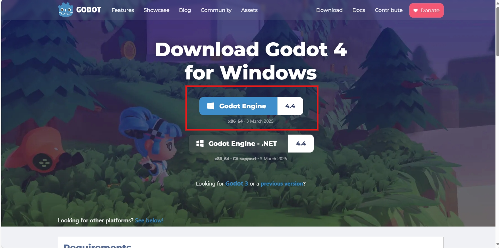
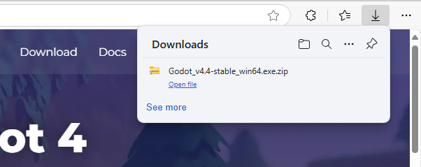
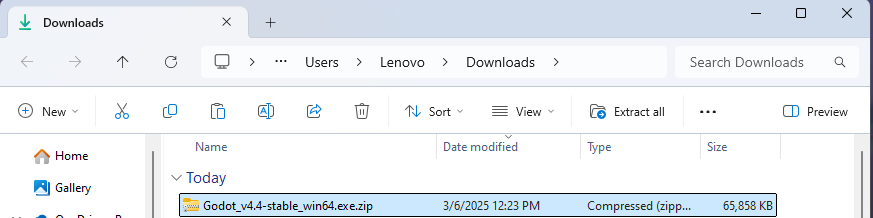
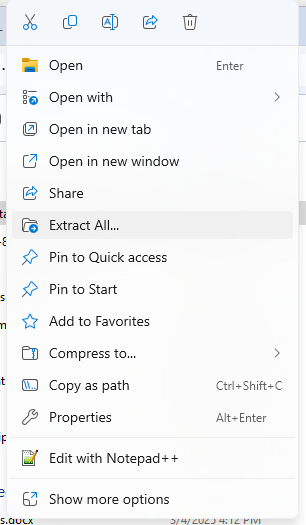
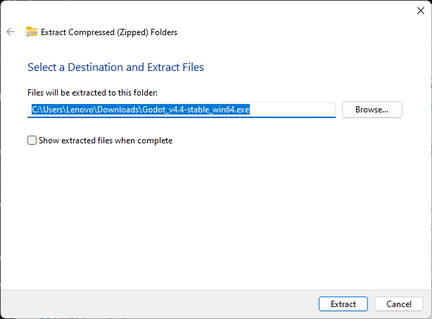
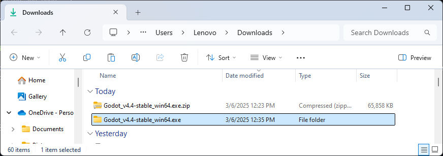
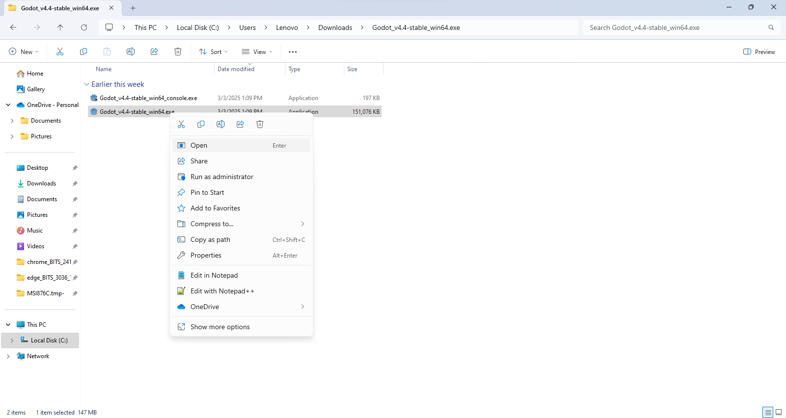
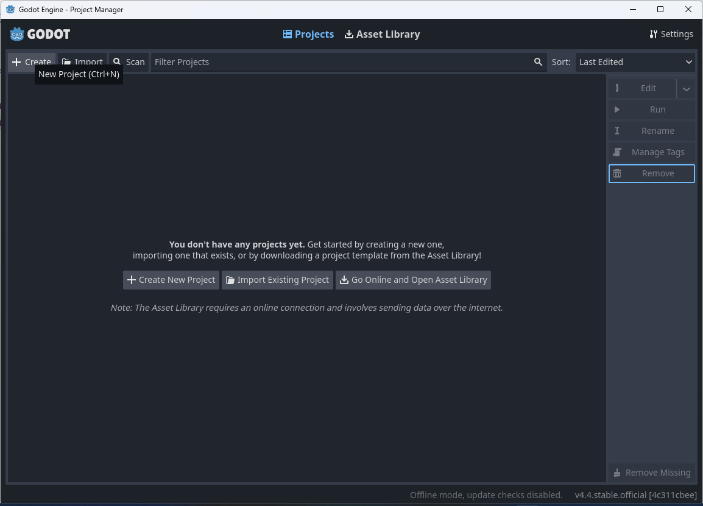
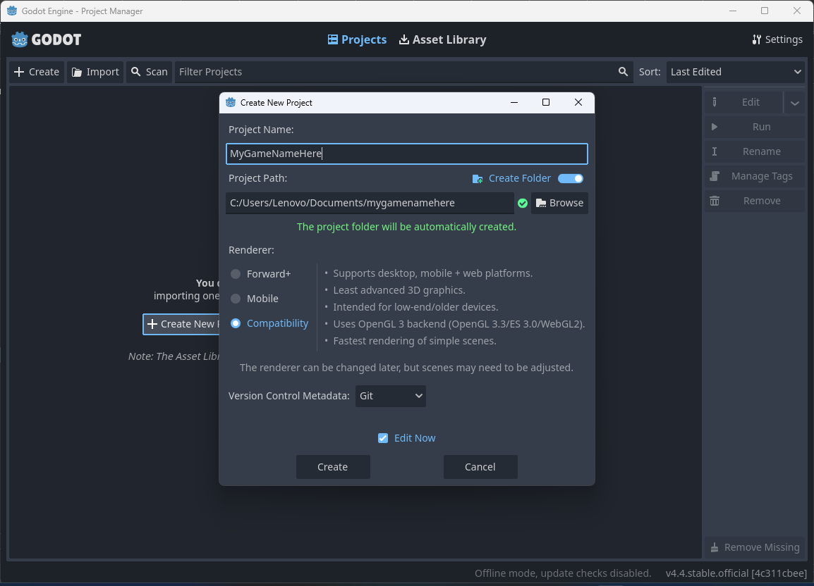

<!--Installation and prep -->

This section focuses on getting Godot set up on your system before you follow further guides.

> [!NOTE]
> While this is an OSS Guide, we are targeting a more mainstream audience so these screenshots were taken on windows. 

You need to go to the [official download link](https://godotengine.org/download) inside the browser. Since we're going to be using windows, it automatically redirected us to the windows page.

> [!TIP]
> For this guide, we will be downloading the regular one because we aren't using the .NET features.

## Download Guide

Follow the given instructions to download and get started with Godot.
::: details Download Guide

https://godotengine.org/download

<!-- Now, go to the Folder it saved the archive in and extract it using mouse's right click and extract all -->

:::

## Getting Started

> [!TIP]
> Remember to change the name to your liking and select "Compatibility" so that we can eventually publish our game on web

Now, go to the next section