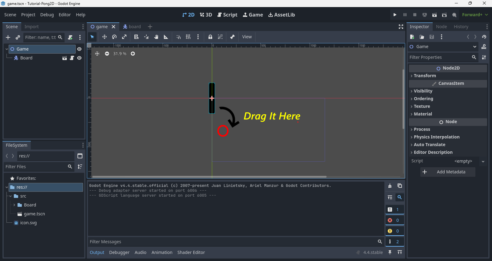
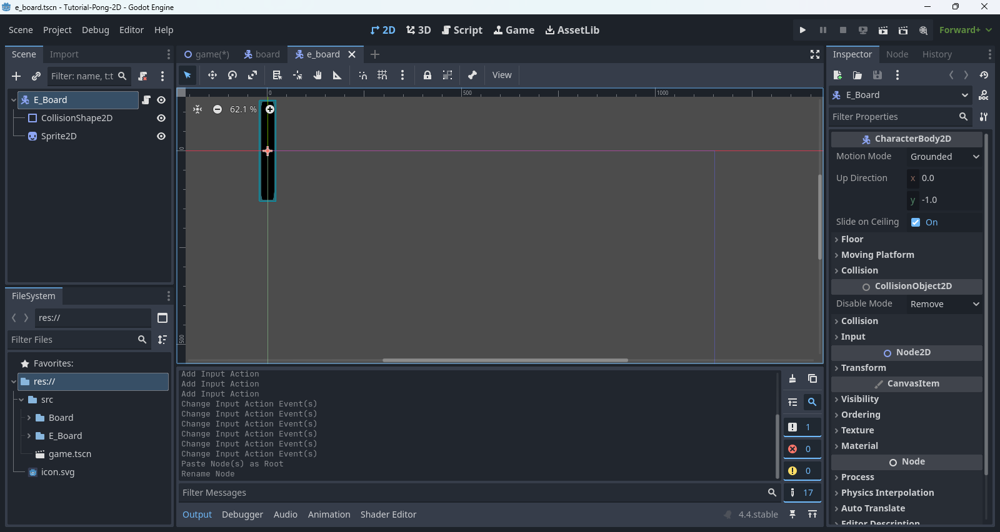
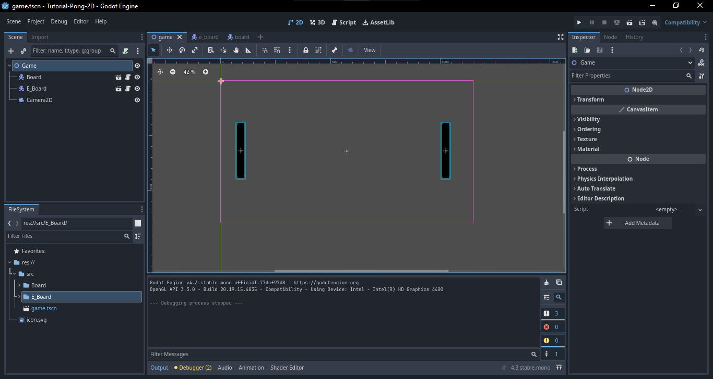
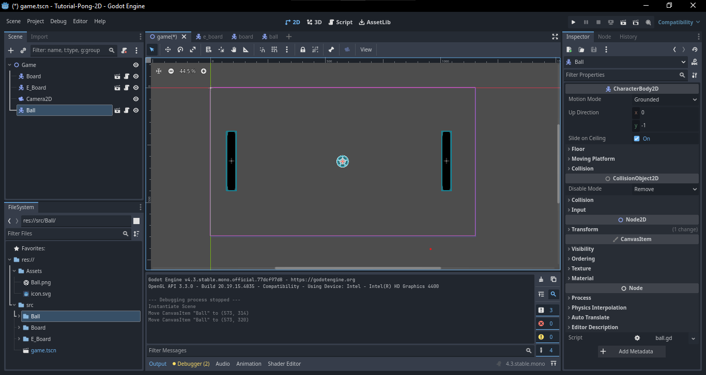
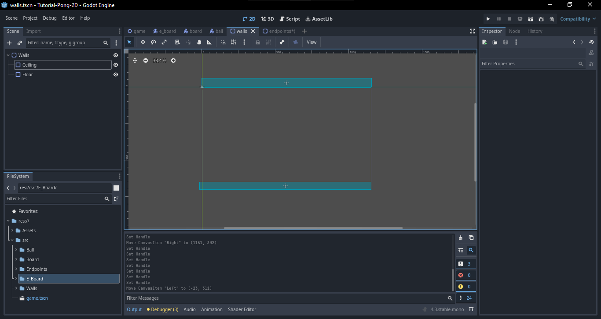

<!-- use diffs at every point -->

> [!WARNING]
> This guide is unfinished, and this will be fully filled out later.

# Implementing Game Logic
## Board Movement
23. Add this code to get the board move up and down in the y axis: 

```GDScript
extends CharacterBody2D

const SPEED := 300.0
const getXDir := 0

func getYDir() -> float:
	return Input.get_action_strength("down") - Input.get_action_strength("up")
	
func _physics_process(delta: float) -> void:
	var dir: Vector2 = Vector2(getXDir, getYDir())
	velocity = dir * SPEED
	move_and_slide()
```

24. Before this, remember to drag the board to the left side in the 2D in game node



25. To the Same for the Enemy Board except for the script and how it is placed in 2D of game node, also remember to save it as E_Board folder in src.



26. This is how the script gonna be for the Enemy board.

```GDScript
extends CharacterBody2D

const SPEED := 300.0
const getXDir := 0

func getYDir() -> float:
	return Input.get_action_strength("e_down") - Input.get_action_strength("e_up")
	
func _physics_process(delta: float) -> void:
	var dir: Vector2 = Vector2(getXDir, getYDir())
	velocity = dir * SPEED
	move_and_slide()
```

27. Now link the E_Board node to the game node and drag to the right side in the 2D Canvas.


28. Now add a Camera 2D in game.

29. With everything done, try running the game by pressing (F5) if that doesn't work (Ctrl + Shift + F5).



30. Try moving both the board using Up and Down Arrow and also with W and S.
31. Now lets add the ball, by using the same CharacterBody2D node like the board.
32. Except this time we will be using a different icon and `CollisionShape2D`, the icon is downloaded from Google Fonts and CollisionShape we will be using `CircleShape2D`.

> [!TIP]
> This section is optional


33. Don't forget to save the file to a folder called Ball in src and to store both the .tscn and .gd file in src.


## Ball Bounce
34. Now we are gonna add a script to the ball to bounce and move the ball.

```GDScript
extends CharacterBody2D


const SPEED = 15.0
var initial_position: Vector2

func _ready() -> void:
	velocity = Vector2(-SPEED, 0)
	initial_position = position

func _physics_process(delta: float) -> void:
	var col: KinematicCollision2D = move_and_collide(velocity)
	if col:
		if col.get_collider().is_in_group("Walls"):  
			reset()
		else:
			var normal := col.get_normal()
			velocity = velocity.bounce(normal)
	
func reset() -> void:
	position = initial_position
	velocity = Vector2(-SPEED, 0)

```

35. After adding the script link the ball node the game node same as how the board's were linked.
36. Now drag the ball to the bottom of the game in the 2D canvas.



37. Now try run the Game again.

## Simple Game Reset

> [!NOTE]
> This serves as a "Fail" for one of the players where the ball resets if you let it pass. You can freely experiment with this and work on implementing things like a scoreboard, a timer before the next game starts, etc. 

38. Just for clarification, we haven't added any wall in the game yet, so the ball might go into oblivion or worse.
39. For now, the game doesn't have an end, as it wont show any scores.

40. For the  Ceiling and Floor, we will be using `StaticBody2D` so as same as how the board's and ball was insert in the same way we add the `StaticBody2D`.
41. As save it in another folder called Walls in the src.



42. For the `CollisionShape2D` node use RectangleShape2D for the Walls.  
43. For the Sides we will create a new scene with `StaticBody2D` called Endpoints with `CollisionShape2D` as the sides and save it in a folder called Endpoints.


44. Now link the Wall node with the game node.
45. And Group the Endpoint and call it Walls, this is so that the balls reset when they hit them.


46. Now Try run the game and enjoy the game without an end. :smile:

47. If we face any issues like the board moving with ball, just remember to change the motion mode property of `CharacterBody2D` from Grounded to Floating for both boards.

