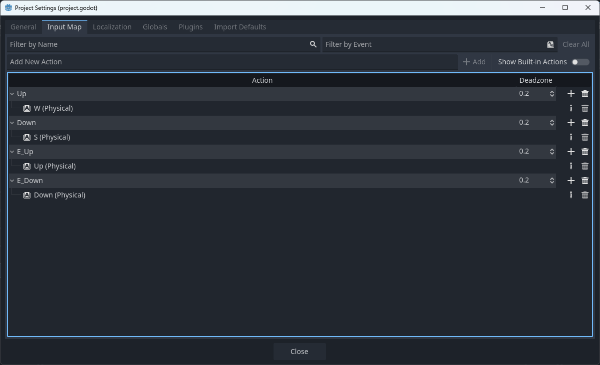

> [!TIP]
> How does our game know which key/action/movement is equivalent to an in-game action? It doesn't! We use an "Input Map" to easily manage potential input options. Here, we'll set `W` key for `up` action and `S` key for `down` down for player 1 along with  `↑` key for `up` action and `↓` key for `down` down for player 2

# Input Handling
22. We insert the script we have to assign Input Map to the reciprocal keys.

22. This is how it look after we insert the input map.

We'll assign in-game functionality to it in the later sections