<!-- use screenshots as much as possible -->

1. Select 2D Scene node to create the parent node

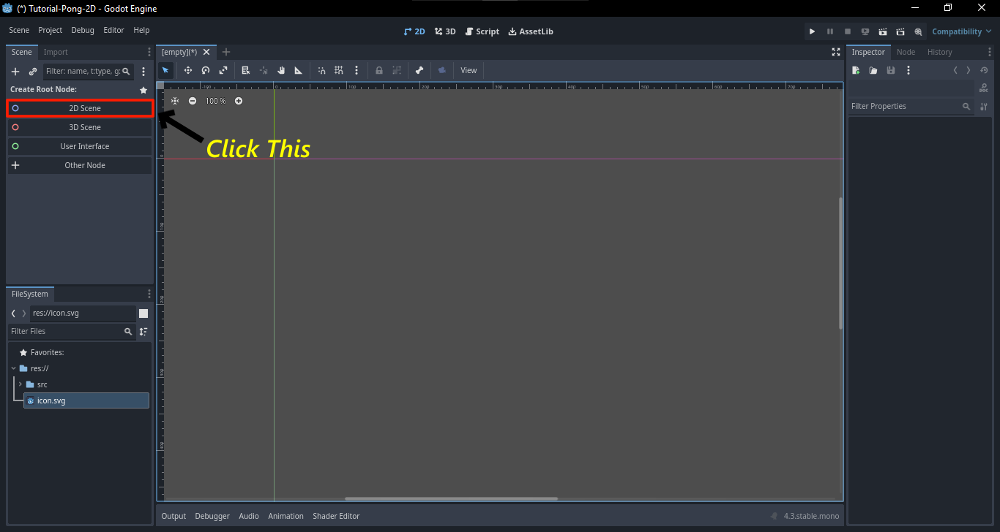

2. Rename it to Game
3. Press Ctrl + S to save the node called Game.

4. Create a folder called src where all the game node and code will be stored and press OK to save the Game.tscn.
5. Next we have to create a scene, to create a scene we have to click the plus icon above the canvas.

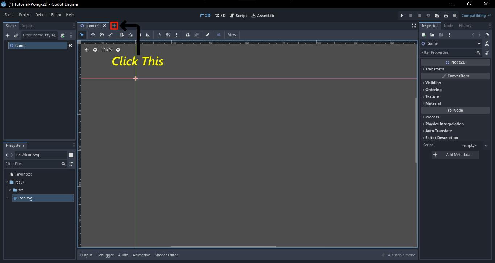

6. Which will look the same as we selected 2D Scene, but rather that clicking 2D Scene click on Other Node [press Ctrl + A].
7. For this tutorial we are gonna creating Pong-2D game, so we will use character2D for the board.

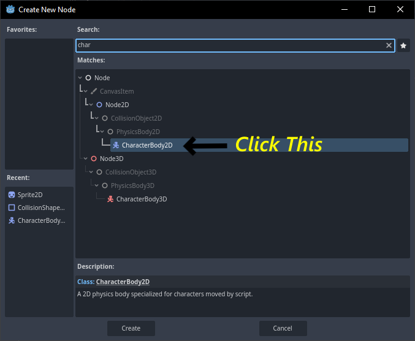

8. After adding character2D, rename it to Board and save it to the folder board in src.
9. To add image we are use a node called Sprite which come under the Board node [previously Character2D].

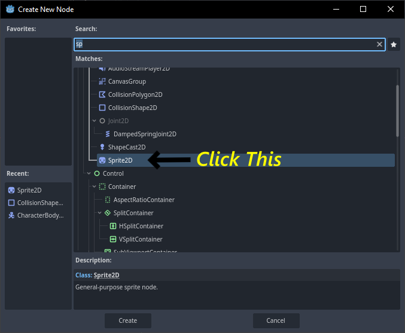

10. To add an image the sprite, first click on the Sprite2D, then we have to drag the image from the FileSystem to Texture under Inspector tab on the top-right.

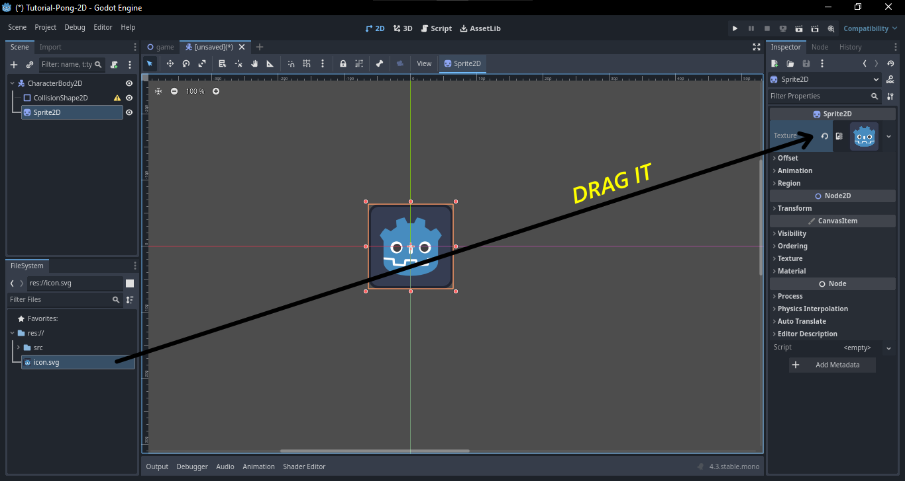

11. We can resize it concurrently by pressing Alt + drag from the edge.
12. We can change the color of the image by click Modulate from Visibility option under CanvasItem tab.

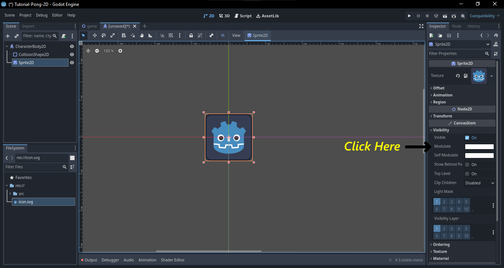

13. Now to add collision to a character, we are gonna use a node called CollisionShape2D which will come under board node.


14. Now click on the CollisionShape2D, on the top-right corner under the properties of CollisionShape2D tab and click on the drop-down in shapes option. And choose the desired shapes for the collision body.

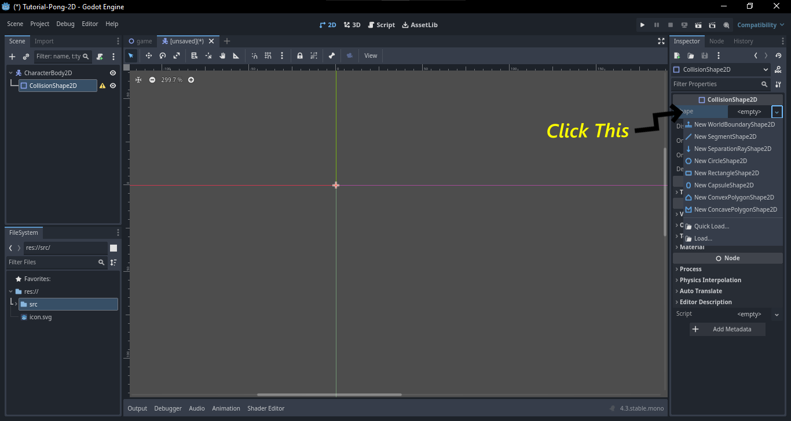

15. For this docs, we are choosing rectangle for the board, you guys can experiment with it.

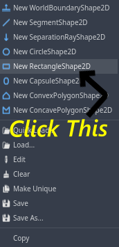

16. Just as Resizing the image we can do the same thing here for CollisionShape2D.
17. After all the tweaking it will look like this.

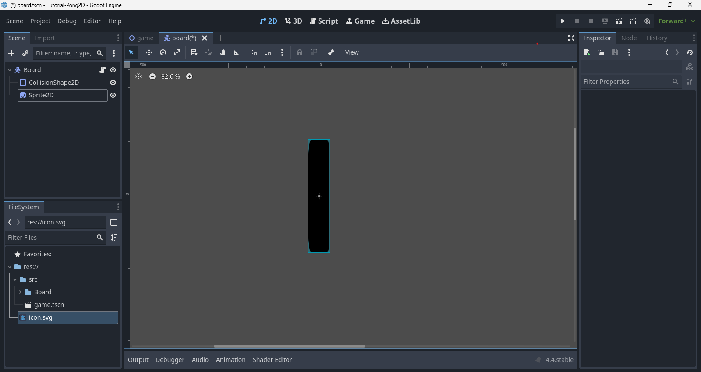

18. To add a script to the board, first we have to click on the board node and click on the script icon on the top.

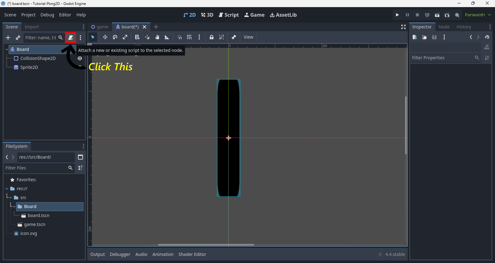

19. Let file name be the same as the board node(like board.gd).
20. And this will open the script editor when we can add the code/script for the specified node.
21. After we have do this we have to link this to the parent node which is named game node


22. We insert the script we have to assign Input Map to the reciprocal keys.

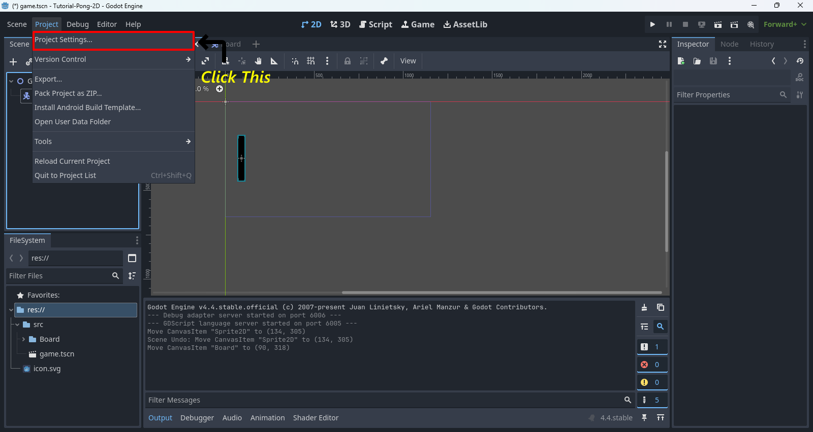

22. This is how it look after we insert the input map.

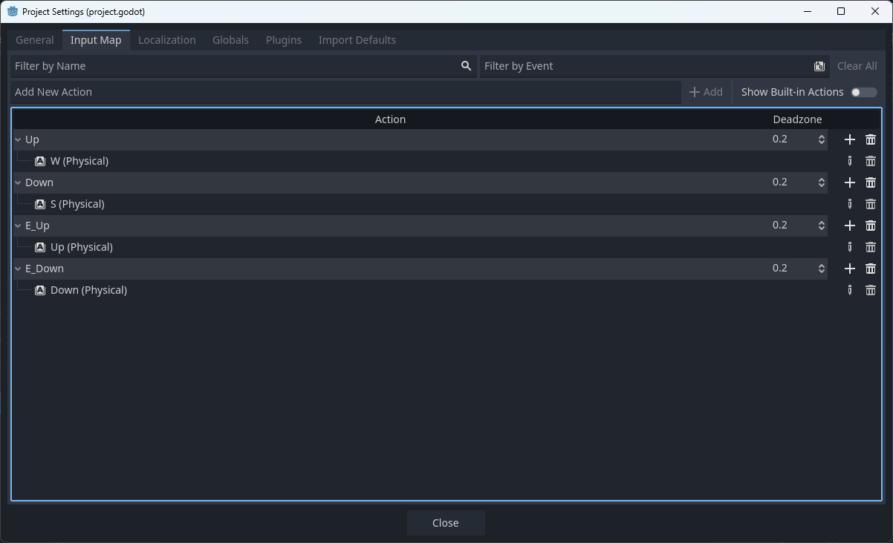


23. Add this code to get the board move up and down in the y axis: 

```GDScript
extends CharacterBody2D

const SPEED := 300.0
const getXDir := 0

func getYDir() -> float:
	return Input.get_action_strength("down") - Input.get_action_strength("up")
	
func _physics_process(delta: float) -> void:
	var dir: Vector2 = Vector2(getXDir, getYDir())
	velocity = dir * SPEED
	move_and_slide()
```

24. Before this, remember to drag the board to the left side in the 2D in game node

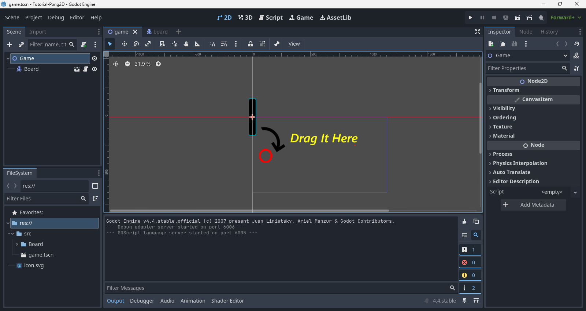

25. To the Same for the Enemy Board except for the script and how it is placed in 2D of game node, also remember to save it as E_Board folder in src.

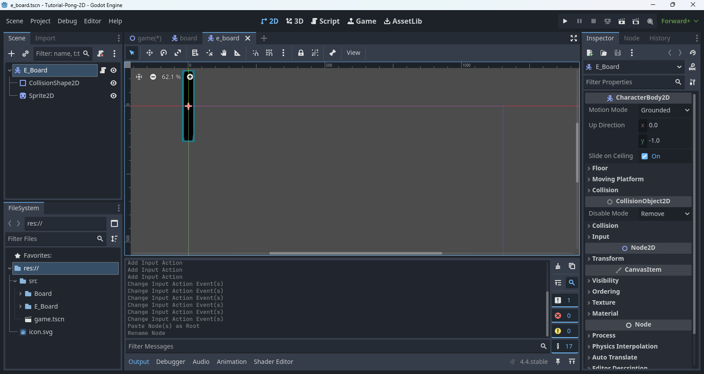

26. This is how the script gonna be for the Enemy board.

```GDScript
extends CharacterBody2D

const SPEED := 300.0
const getXDir := 0

func getYDir() -> float:
	return Input.get_action_strength("e_down") - Input.get_action_strength("e_up")
	
func _physics_process(delta: float) -> void:
	var dir: Vector2 = Vector2(getXDir, getYDir())
	velocity = dir * SPEED
	move_and_slide()
```

27. Now link the E_Board node to the game node and drag to the right side in the 2D Canvas.


28. Now add a Camera 2D in game.

29. With everything done, try running the game by pressing (F5) if that doesn't work (Ctrl + Shift + F5).

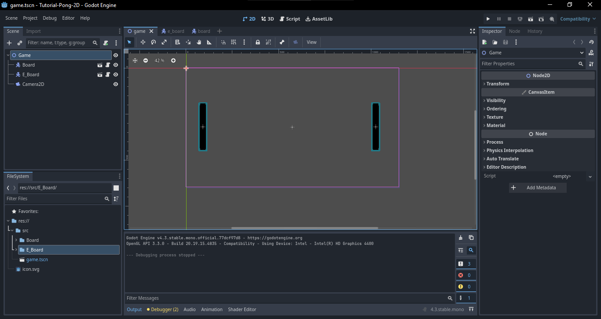

30. Try moving both the board using Up and Down Arrow and also with W and S.
31. Now lets add the ball, by using the same character2D node like the board.
32. Except this time we will be using a different icon and CollisionShape2D, the icon is downloaded from Google Fonts and CollisionShape we will be using CircleShape2D.

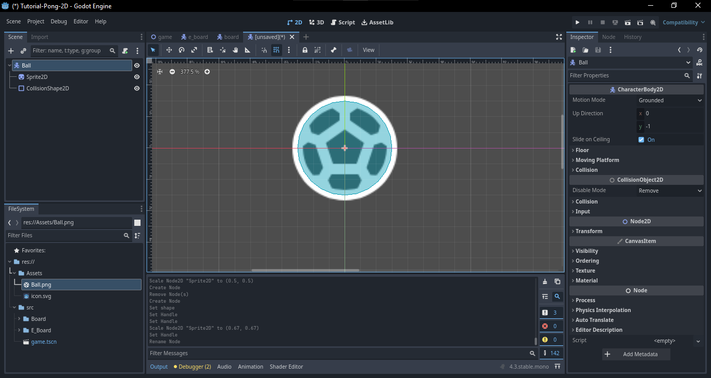

33. Don't forget to save the file to a folder called Ball in src and to store both the .tscn and .gd file in src.
34. Now we are gonna add a script to the ball to bounce and move the ball.

```GDScript
extends CharacterBody2D

const SPEED = 15.0

func _ready() -> void:
	velocity = Vector2(-SPEED, 0)

func _physics_process(delta: float) -> void:
	var col: KinematicCollision2D = move_and_collide(velocity)
	if col:
		var normal := col.get_normal()
		velocity = velocity.bounce(normal)
```

35. After adding the script link the ball node the game node same as how the board's were linked.
36. Now drag the ball to the bottom of the game in the 2D canvas.

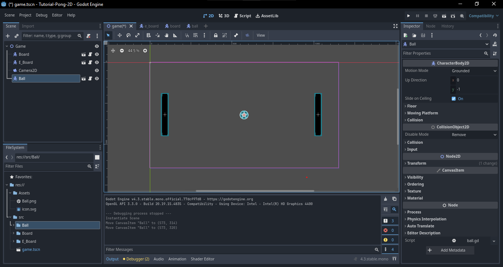

37. Now try run the Game again.
38. Just for clarification, we never add any wall in the game, so the ball might go into oblivion.
39. For now, the game doesn't have an end, as it wont show any scores.
<!--40. Now we will add -->

40. For the walls, we will be using StaticBody2D so as same as how the board's and ball was insert in the same way we add the StaticBody2D.
41. As save it in another folder called Walls in the src.

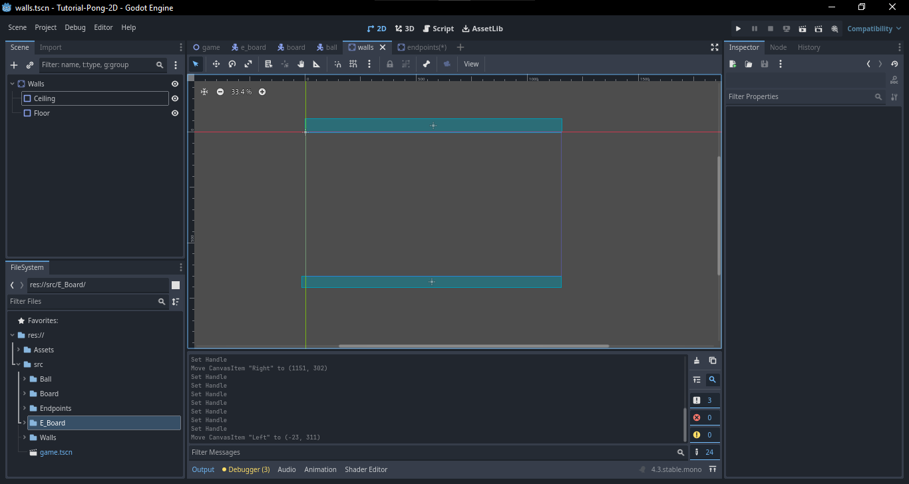

42. For the CollisionShape2D node use RectangleShape2D for the Walls.  

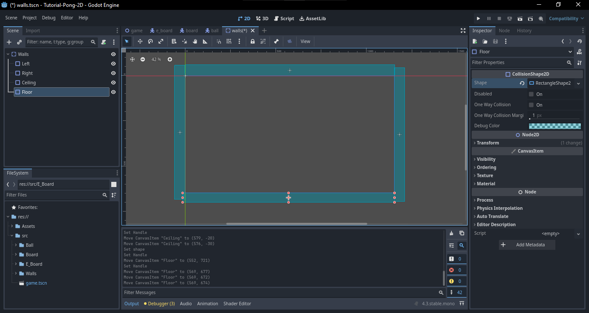

43. Now link the Wall node with the game node.
44. Finally it will look like this.

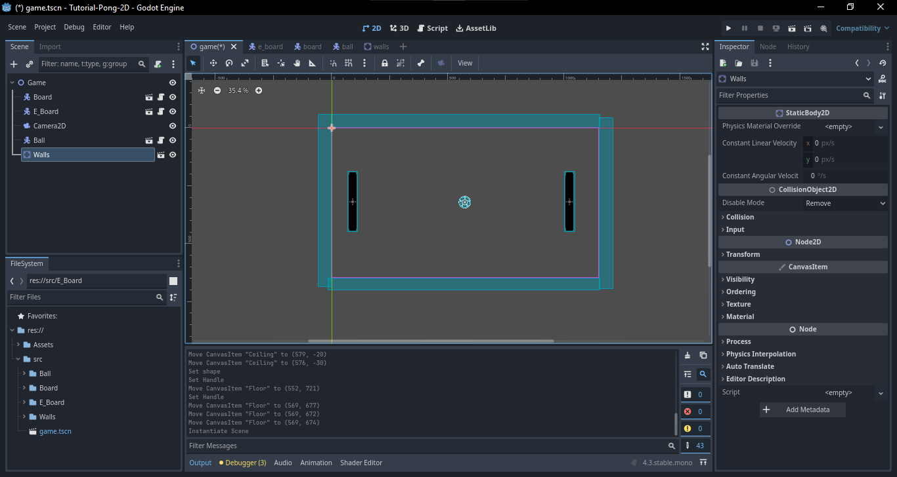

45. Now Try run the game and enjoy the game without an end. :smile:

46. We if face any issues like the board moving with ball just remember to change the motion mode property of CharacterBody2D from Grounded to Floating for both boards.

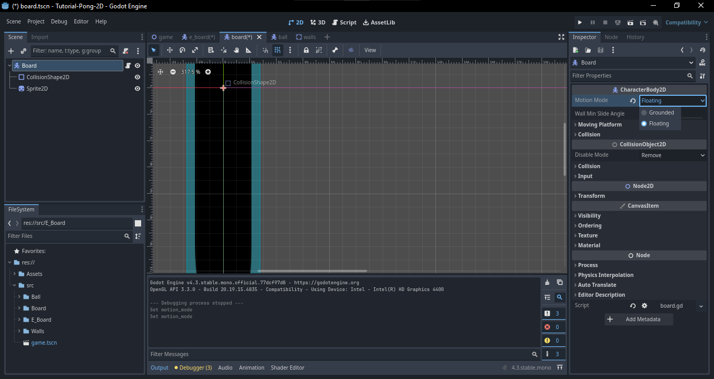