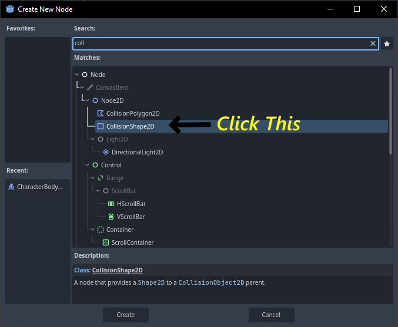

<!-- use screenshots as much as possible -->

1. Select 2D Scene node to create the parent node

2. Rename it to Game
3. Press Ctrl + S to save the node called Game.

4. Create a folder called src where all the game node and code will be stored and press OK to save the Game.tscn.
5. Next we have to create a scene, to create a scene we have to click the plus icon above the canvas.

6. Which will look the same as we selected 2D Scene, but rather that clicking 2D Scene click on Other Node [press Ctrl + A]
7. For this tutorial we are gonna creating Pong-2D game, so we will use character2D for the board.

8. After adding character2D, rename it to Board and save it to the folder board in src.
9. To add image we are use a node called Sprite which come under the Board node [previously Character2D].

10. To add an image the sprite, first click on the Sprite2D, then we have to drag the image from the FileSystem to Texture under Inspector tab on the right-top side.

11. Now to add collision to a character, we are gonna use a node called CollisionShape2D which will come under board node.

