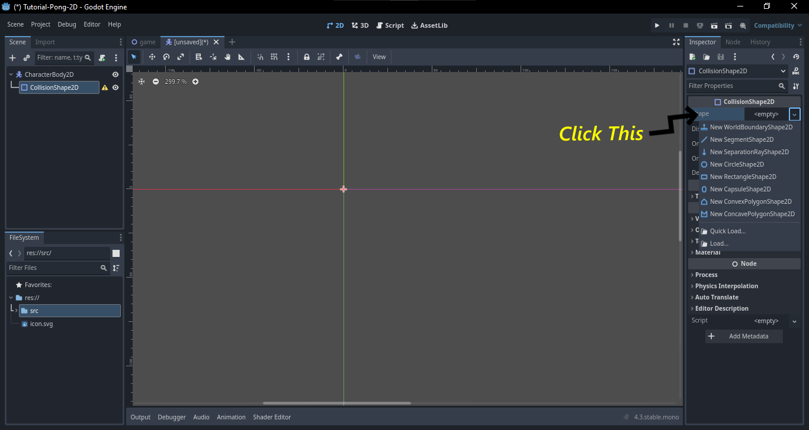

<!-- use screenshots as much as possible -->

1. Select 2D Scene node to create the parent node


2. Rename it to Game
3. Press Ctrl + S to save the node called Game.

4. Create a folder called src where all the game node and code will be stored and press OK to save the Game.tscn.
5. Next we have to create a scene, to create a scene we have to click the plus icon above the canvas.


6. Which will look the same as we selected 2D Scene, but rather that clicking 2D Scene click on Other Node [press Ctrl + A].
7. For this tutorial we are gonna creating Pong-2D game, so we will use character2D for the board.


8. After adding character2D, rename it to Board and save it to the folder board in src.
9. To add image we are use a node called Sprite which come under the Board node [previously Character2D].


10. To add an image the sprite, first click on the Sprite2D, then we have to drag the image from the FileSystem to Texture under Inspector tab on the top-right.


11. We can resize it concurrently by pressing Alt + drag from the edge.
12. We can change the color of the image by click Modulate from Visibility option under CanvasItem tab.


13. Now to add collision to a character, we are gonna use a node called CollisionShape2D which will come under board node.


14. Now click on the CollisionShape2D, on the top-right corner under the properties of CollisionShape2D tab and click on the drop-down in shapes option. And choose the desired shapes for the collision body.



15. For this docs, we are choosing rectangle for the board, you guys can experiment with it.


16. Just as Resizing the image we can do the same thing here for CollisionShape2D.
17. After all the tweaking it will look like this.


18. To add a script to the board, first we have to click on the board node and click on the script icon on the top.


19. Let file name be the same as the board node(like board.gd).
20. And this will open the script editor when we can add the code/script for the specified node.
21. After we have do this we have to link this to the parent node which is named game node


2. Add this code to get the board move up and down in the y axis: 

```GDScript
extends CharacterBody2D

const SPEED := 300.0
const getXDir := 0

func getYDir() -> float:
	return Input.get_action_strength("down") - Input.get_action_strength("up")
	
func _physics_process(delta: float) -> void:
	var dir: Vector2 = Vector2(getXDir, getYDir())
	velocity = dir * SPEED
	move_and_slide()
```

